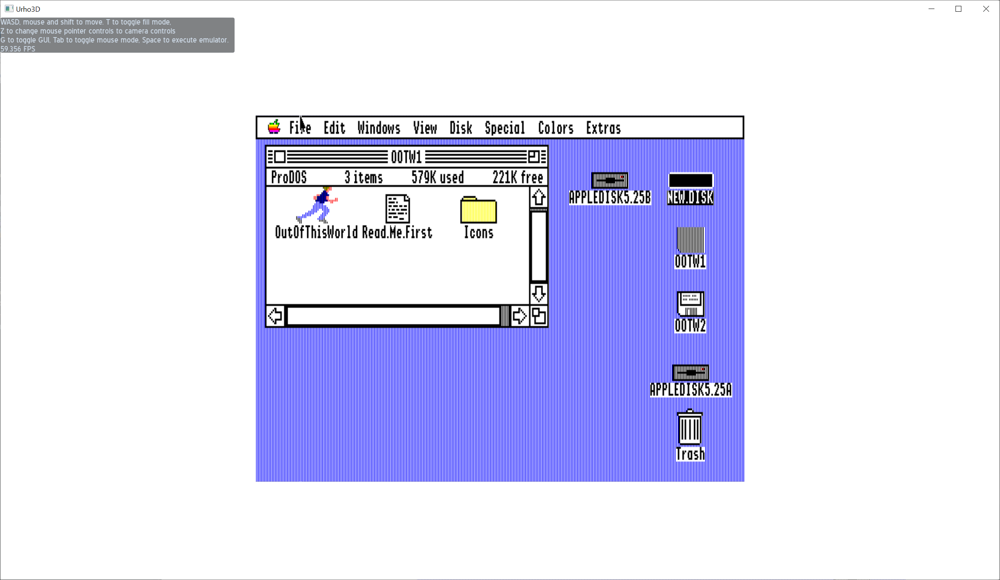

## Apple 2GS Emulator for Urho3D

This project was part of a large project that is unlikely to be completed at some point.
It is based on Kegs32, ~~Boost (threads and regexes)~~std::futures. Tested only for MinGW-64 on Windows.

Mouse, keyboard, sound, and image output work. The joystick and serial connections are not implemented
(I don't know why this might be useful now).

### Controls

* WASD - Move
* T - Wireframe mode
* Z - Change controls
* Space - Run emulator